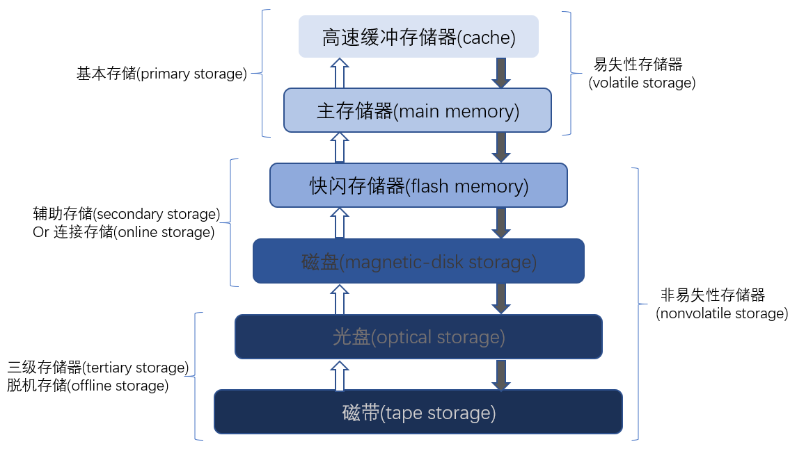
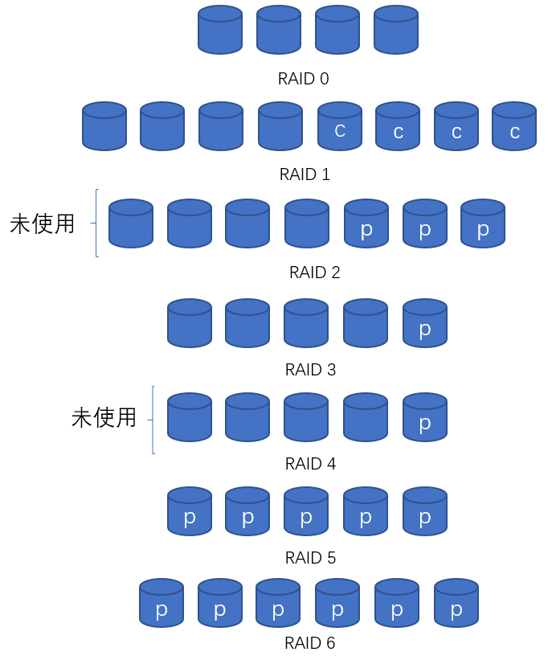
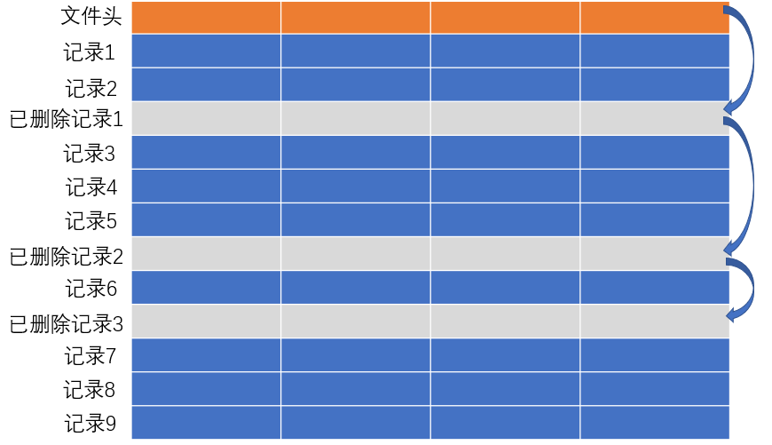
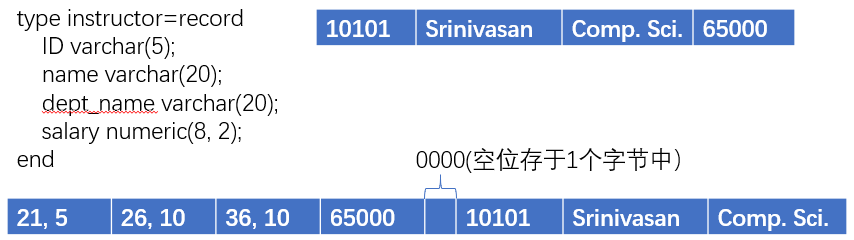
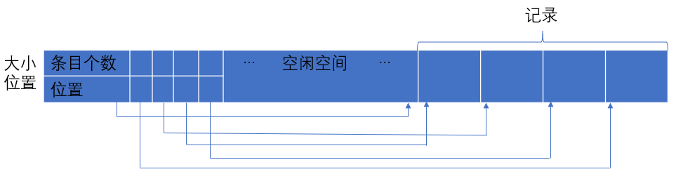

# Chapter10: 数据存储和查询

## 10.1 物理存储介质概述

* 高速缓冲存储器(cache)
* 主存储器(main memory)
* 快闪存储器(flash memory)
* 磁盘存储器(magnetic-disk storage)
* 官学存储器(optical storage)
* 磁带存储器(tape storage)

&emsp;&emsp;存储设备层次结构:

## 10.2 磁盘和快闪存储器

### &emsp; 10.2.1 磁盘的物理特性
* 盘片(platter)
* 磁道(track)
* 扇区(sector) <input type="button" style="border-width:0;background:#FF8C00;padding:4px;border-radius:4px" value="读写信息的最小单位"/>
* 读写头(read-write head)
* 磁盘臂(disk arm)
* 柱面(cylinder)
* 磁盘控制器(disk controller) <input type="button" style="border-width:0;background:#FF8C00;padding:4px;border-radius:4px" value="坏扇区重映射(remapping of bad sector"/> <input type="button" style="border-width:0;background:#FF8C00;padding:4px;border-radius:4px" value="校验和(checksum)"/>

&emsp;&emsp;在存储区局域网体系结构中，大量的磁盘通过高速网络与许多计算机服务器项链。通常磁盘采用独立磁盘冗余阵列(Redundant Array of Independent Disk, RAID)技术进行本地化组织。
### &emsp; 10.2.2 磁盘性能的度量
* 容量
* 访问时间(access time) <input type="button" style="border-width:0;background:#FF8C00;padding:4px;border-radius:4px" value="寻道时间(seek time)"/> <input type="button" style="border-width:0;background:#FF8C00;padding:4px;border-radius:4px" value="旋转等待时间(rotational latency time"/>
* 数据传输率(data-transfer rate)
* 可靠性 <input type="button" style="border-width:0;background:#FF8C00;padding:4px;border-radius:4px" value="平均故障时间(Mean Time TO Failure, MTTF"/>

### &emsp;10.2.3 磁盘块访问的优化
* 缓冲(buffering)
* 预读(read-ahead)
* 调度(scheduling) <input type="button" style="border-width:0;background:#FF8C00;padding:4px;border-radius:4px" value="磁盘臂调度算法(disk-arm-scheduling)"/> <input type="button" style="border-width:0;background:#FF8C00;padding:4px;border-radius:4px" value="电梯算法(elevator algorithm)"/>
* 文件组织(file organization)
* 非易失性写缓冲区(nonvolatile write buffer) <input type="button" style="border-width:0;background:#FF8C00;padding:4px;border-radius:4px" value="非易失性随机访问存储器(NonVolatile Random-Access Memory, NV-RAM)"/>
* 日志磁盘(log disk)

### &emsp;10.2.4 快闪存储 <input type="button" style="border-width:0;background:#9400D3;padding:4px;border-radius:4px" value="NOR"/>  <input type="button" style="border-width:0;background:#9400D3;padding:4px;border-radius:4px" value="NAND"/>

* 擦除块(erase block)
* 转换表(translation table)
* 损耗均衡(wear leveling)
* 闪存转换层(flash translation layer)

## 10.3 RAID <input type="button" style="border-width:0;background:#9400D3;padding:4px;border-radius:4px" value="Redundant Array of Independent Disk"/>

### &emsp;10.3.1 通过冗余提高可靠性 <input type="button" style="border-width:0;background:#9400D3;padding:4px;border-radius:4px" value="冗余(redundancy)"/> <input type="button" style="border-width:0;background:#9400D3;padding:4px;border-radius:4px" value="镜像(mirroring)"/>

### &emsp;10.3.2 通过并行提高性能 <input type="button" style="border-width:0;background:#9400D3;padding:4px;border-radius:4px" value="数据拆分(striping data)"/> <input type="button" style="border-width:0;background:#9400D3;padding:4px;border-radius:4px" value="比特及拆分(bit-level striping)"/> <input type="button" style="border-width:0;background:#9400D3;padding:4px;border-radius:4px" value="块级拆分(block-level striping)"/>

### &emsp;10.3.3 RAID 级别
&emsp;&emsp;镜像提供了高可靠性，但它十分昂贵。拆分提供了搞数据传输率，但不能提高可靠性。
* RAID 0 级: 拆分但没有冗余
* RAID 1 级: 拆分+镜像
* RAID 2 级: 内存风格的纠错码组织结构(Error-Correcting-Code, ECC), 使用奇偶校验码
* RAID 3 级: 位交叉的奇偶校验组织结构
* RAID 4 级: 块交叉的奇偶校验组织结构
* RAID 5 级: 块交叉的分布奇偶校验位的组织结构
* RAID 6 级: P+Q冗余方案，应对多张磁盘发生故障的情况

### &emsp;10.3.4 RAID 级别的选择
* RAID 0 级用于数据安全性不是很重要的高性能应用
* RAID 3比特及拆分 不如 RAID 5块级拆分
* RAID 6 级提供很高的可靠性，可以用于数据安全十分重要的应用
* RAID 1 级提供最好的写操作性能，因此在数据库系统日志文件的存储这样的应用中广泛应用
* RAID 5 级与RAID 1级相比具有较低的存储负载，但写操作需要更高的时间开销，所以对于经常进行读操作很少进行写操作的应用，RAID 5 级是首选
* RAID 1 级适合中等存储需求和高I/O需求的应用的RAID选择

### &emsp;10.3.5 硬件问题 <input type="button" style="border-width:0;background:#9400D3;padding:4px;border-radius:4px" value="擦洗(scrubbing)"/> <input type="button" style="border-width:0;background:#9400D3;padding:4px;border-radius:4px" value="热交换(hot swapping)"/>

## 10.4 第三级存储

## 10.5 文件组织 <input type="button" style="border-width:0;background:#9400D3;padding:4px;border-radius:4px" value="文件(file)"/> <input type="button" style="border-width:0;background:#9400D3;padding:4px;border-radius:4px" value="块(block)"/> <input type="button" style="border-width:0;background:#9400D3;padding:4px;border-radius:4px" value="记录"/>

### 10.5.1 定长记录
* 一个块中只分配它能完整容纳下的最大的记录数
* 让已被删除的记录空着，一直等到随后进行插入操作重用这个空间。
* 添加文件头(file header), 存储第一条被删除记录的地址 <input type="button" style="border-width:0;background:#FF8C00;padding:4px;border-radius:4px" value="空闲列表(free list)"/>

### 10.5.2 变长记录

* 一条有变长属性的记录通常具有两部分：初始部分是定长属性，接下来是变长属性。对于鼎昌属性，分配存储他们的值所需的字节数。对于变长属性，在记录的初始部分中表示为(偏移量, 长度)值，其中偏移量表示在记录中该属性的数据开始的位置，长度表示边长属性的字节长度；在记录初始定长部分之后，这些属性的值是连续存储的。 <input type="button" style="border-width:0;background:#FF8C00;padding:4px;border-radius:4px" value="空位图(null bitmap)"/>

* 分槽的页结构(slotted-page stucture)一般用于在块中组织记录。
  * 块头中记录条目的个数
  * 块中空闲空间的末尾位置
  * 一个由包含纪律位置和大小的记录条目组成的数组

## 10.6 文件中记录的组织

* 堆文件组织(heap file orgnaization)
* 顺序文件组织(sequential file organization)
* 散列文件组织(hashing file organization)
* 多表聚簇文件组织(multitable clustering file organization)

### &emsp;10.6.1 顺序文件组织 <input type="button" style="border-width:0;background:#9400D3;;padding:4px;border-radius:4px" value="搜索码(search key)"/> <input type="button" style="border-width:0;background:#9400D3;;padding:4px;border-radius:4px" value="重组(reorganized)"/>

### &emsp;10.6.2 多表聚簇文件组织

&emsp;&emsp;多表聚簇文件组织(multitable clustering file organization)是一种在每一个块中存储两个或者更多个关系的相关记录的文件结构。这样的文件结构允许我们使用一次块的读操作来读取满足连接条件的记录。

&emsp;&emsp;何时使用多表聚簇文件组织依赖于数据设计者所认为的最频繁的查询类型。多表聚簇文件组织的谨慎使用可以在查询处理中产生明显的性能提高。

## 10.7 数据字典(data dictionary)存储 <input type="button" style="border-width:0;background:#9400D3;;padding:4px;border-radius:4px" value="元数据(metadata)"/>

## 10.8 数据库缓冲区

### 10.8.1 缓冲区管理器
* 缓冲区替换策略(buffer replacement strategy)
* 被钉住的块(pinned block)
* 块的强制写出(forced output of block)

### 10.8.2 缓冲区替换策略
&emsp;&emsp;数据库系统能够比操作系统更准确的预测未来的访问模式。 <input type="button" style="border-width:0;background:#FF8C00;padding:4px;border-radius:4px" value="least recent used, LRU"/>  <input type="button" style="border-width:0;background:#FF8C00;padding:4px;border-radius:4px" value="立即丢弃(toss-immediate)"/> <input type="button" style="border-width:0;background:#FF8C00;padding:4px;border-radius:4px" value="Most Recently Used, MRU)"/>

