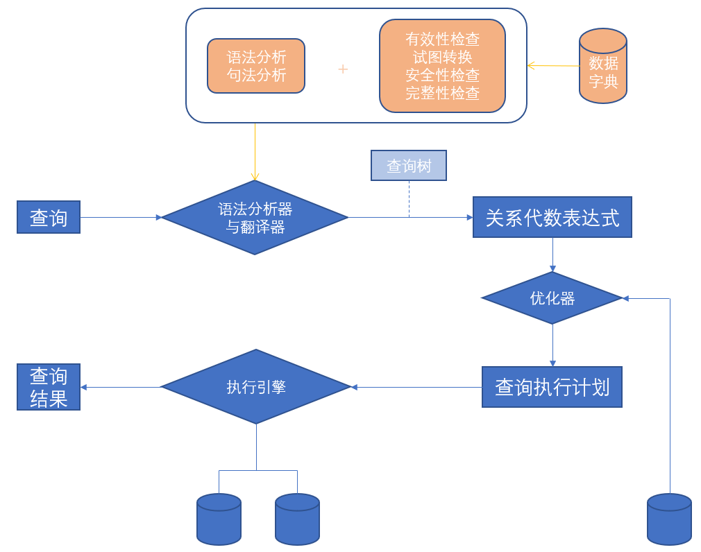
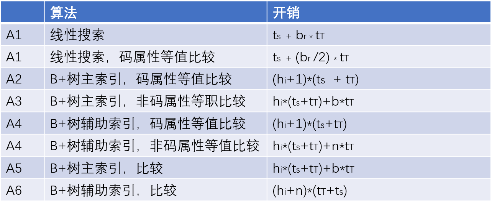

# Chapter12 查询处理

## 12.1 概述 
&emsp;&emsp;查询过程：
* 语法分析与翻译
* 优化
* 执行

<input type="button" style="border-width:0;background:#FFFF00;padding:4px;border-radius:4px" value="计算原语(evaluation primitive)"/> <input type="button" style="border-width:0;background:#FFFF00;padding:4px;border-radius:4px" value="查询执行计划(query-execution plan)"/>

## 12.2 查询代价的度量

&emsp;&emsp;用传送磁盘块数和搜索磁盘次数来度量查询执行计划的代价(b*t[T]+S*t[S])

## 12.3 选择运算

### 12.3.1 使用文件扫描和索引的选择

* A1(线性搜索)
* A2(主索引，码属性等值比较)
* A3(主索引，非码属性等值比较)
* A4(辅助索引，等值比较)

### 12.3.2 设计比较的选择
* A5(主索引，比较)
* A6(辅助索引，比较)

### 12.3.3 复杂选择的实现

* A7(利用一个索引的合取选择)
* A8(使用组合索引的合取选择)
* A9(通过标识符的交实现合取选择)
* A10(通过标识符的并实现析取选择)

## 12.4 排序

### &emsp;12.4.1 外部排序归并算法 <input type="button" style="border-width:0;background:#ee00ff;padding:4px;border-radius:4px" value="外排序(external sorting)"/> <input type="button" style="border-width:0;background:#ee00ff;padding:4px;border-radius:4px" value="外排序归并算法(external sort-merge)"/>

1. 建立多个排好序的归并段(run)
2. 对归并段进行归并 <input type="button" style="border-width:0;background:#aaff00;padding:4px;border-radius:4px" value="N路归并(N-way merge)"/> 

### 12.4.2 外部排序归并算法的代价估计
* 磁盘块传输总数
* 磁盘搜索总次数

## 12.5 连接运算

### 12.5.1 嵌套循环连接
### 12.5.2 块嵌套循环连接
### 12.5.3 索引嵌套循环接连